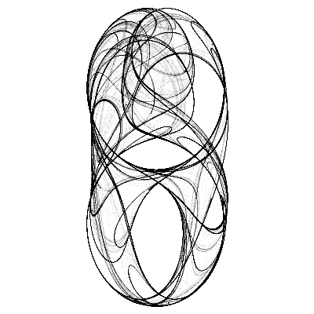
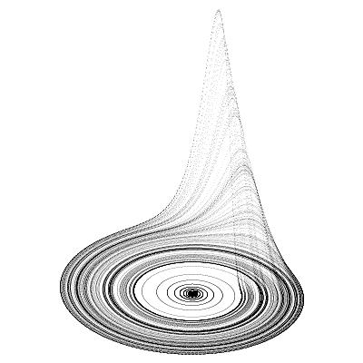

# CG exercises

## Clifford Attractors

    
    
    
    

Attributed to Clifford Pickover.

Definition

    x[n+1] = sin(a * y[n]) + c * cos(a * x[n])
    y[n+1] = sin(b * x[n]) + d * cos(b * y[n])

where a, b, c, d are variabies that define each attractor.
Examples:

    a = 1.6, b = -0.6, c = -1.2, d = 1.6
    a = 1.7, b = 1.7, c = 0.06, d = 1.2
    a = 1.3, b = 1.7, c = 0.5, d = 1.4
    a = 1.5, b = -1.8, c = 1.6, d = 0.9
    a = -1.4, b = 1.6, c = 1.0, d = 0.7
    a = 1.1, b = -1.0, c = 1.0, d = 1.5

Set up a grid of pixel values.
Evaluate points on the attractor and just increment each cell of the grid if the attractor passes through it.
As this is a "chaotic" process, the image will be noisy unless enough "exposure" is achieved by looping many enough times.

You'd stop the loop when the image is nice and smooth enough, but how do you detect that?
One option is to just specify a huge number that will certainly be enough.
Another is to stop iterating when you land on a pixel with a value above some preset.
But in this case you can stop too early if the attractor has high dynamic range
(meaning, a point may reach saturation well before a lot of other points were even touched).

## Pentaflake

<figure>
    
</figure>

- draw a regular pentagon
- replace the pentagon with six smaller similar pentagons (one in the center) in a tiling manner
- repeat with the smaller pentagons

The first iteration of the pentaflake looks like five pentagons arranged around an identical pentagon.
This cluster of six pentagons has the shape of a pentagon with five triangular wedges removed.
Removing triangles is thus another way to construct the fractal.
This construction was first noticed by Albrecht Dürer [Dixon 1991].

## Barnsley Fern

<figure>
    
</figure>

Described by Michael Barnsley.

The process is similar to drawing an attractor,
except on each step one of four predefined formulas is chosen to calculate the next point instead of one.
Each formula has its predefined probability.

    (1), 1%
    x[n+1] = 0
    y[n+1] = 0.16 * y[n]

    (2), 85%
    x[n+1] = 0.85 * x[n] + 0.04 * y[n]
    y[n+1] = -0.04 * x[n] + 0.85 * y[n] + 1.6

    (3), 7%
    x[n+1] = 0.2 * x[n] - 0.26 * y[n]
    y[n+1] = 0.23 * x[n] + 0.22 * y[n] + 1.6

    (4), 7%
    x[n+1] = -0.15 * x[n] + 0.28 * y[n]
    y[n+1] = 0.26 * x[n] + 0.24 * y[n] + 0.44

Each formula is an affine transformation, which means a combination of scaling, rotation and mirroring is used each time to get the next point.
The transformations are devised in such a manner that the point "jumping around" will draw a fern-like figure.

## Thorn fractal

<figure>
    
    
    
    
    
</figure>

Define this complex number series `S(z)`:

    re(z[n+1]) = re(z[n]) / cos(im(z[n])) + re(c)
    im(z[n+1]) = im(z[n]) / sin(re(z[n])) + im(c),

where `c` is a constant.

Then:

- take a complex plane bounded by -pi and pi on both sides
- for each point `p` on that plane start a series `S(z)` using `p` as the first value of `z`
- determine how many steps `n` that series requires for the values modulus to exceed 100
- use `n` as brightness value at that given point.

Use various values of `c` to get various images, for example:

    (0.102, -0.04),
    (1.098, 1.402),
    (9.984, 7.55),
    (0.662, 1.086),
    (-0.354, 0.162)

## Rössler Attractor

Credited to Otto Rossler and arose from work in chemical kinetics.

This is a phase portrait of a chaotic system described as:

    dx/dt = -y - z
    dy/dt = x + a*y
    dz/dt = b + z*(x - c)

where:

    a = 0.2, b = 0.2, c = 5.7
    a = 0.1, b = 0.1, c = 14
